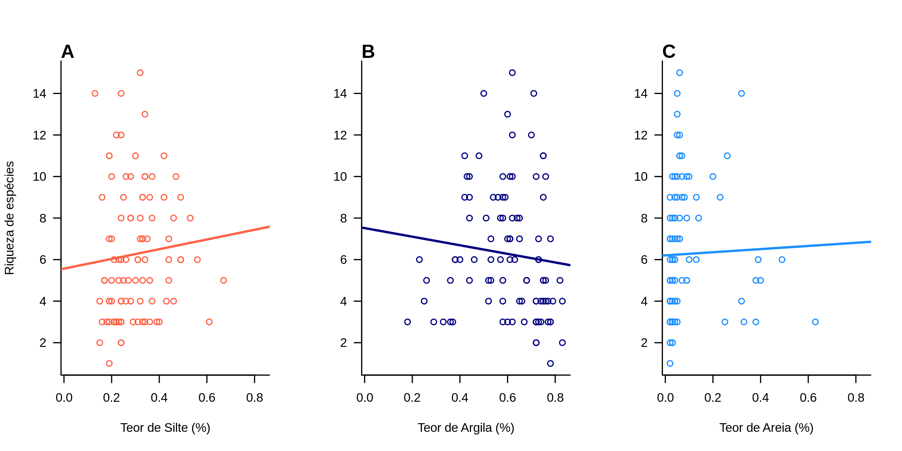

```{r setup, include=FALSE}
knitr::opts_chunk$set(echo = TRUE)
```

## R Markdown

This is an R Markdown document. Markdown is a simple formatting syntax for authoring HTML, PDF, and MS Word documents. For more details on using R Markdown see <http://rmarkdown.rstudio.com>.

When you click the **Knit** button a document will be generated that includes both content as well as the output of any embedded R code chunks within the document. You can embed an R code chunk like this:

```{r iris, echo=FALSE}
summary(iris)
```

## Including Plots

You can also embed plots, for example:

```{r pressure, eval=TRUE, echo=FALSE, fig.width=6, fig.height=5}
plot(pressure)
```

Note that the `echo = FALSE` parameter was added to the code chunk to prevent printing of the R code that generated the plot.

# Section 1



```{r fig, echo=FALSE, eval=FALSE} 
# Aqui está outra forma de colocar a figura, silenciada

```

Para citar, basta colocar assim, [@zuur_protocol_2010], e só para ficar bonnito, vamos citar mais um [@tukey_thoughts_1977]
 
# Bibliografia

